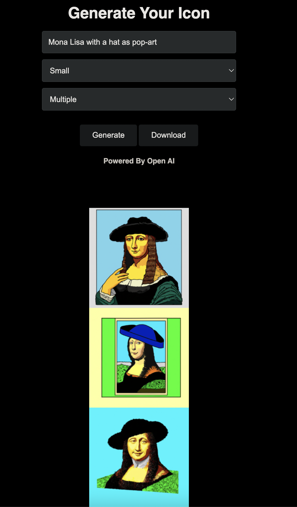

## IconifyMe

Generate your very own custom aesthetic icons using Open AI by simply providing descriptions with our Icon Generator

> Be warned, if you ask OpenAI to draw you a unicorn, you might just end up with a horse with a party hat

### Describe and generate your icon

### Generate multiple icons

### Get realistic images

